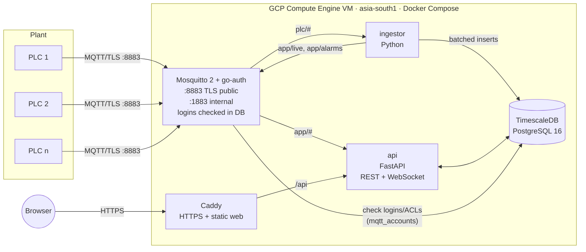

# PLC Integrated Dashboard — Requirements Specification

| Field | Value |
|---|---|
| Status | v0.7 — deployed (demo) |
| Date | 2026-09-26 |
| Owner | Nirbhay |
| Target platform | Google Cloud Platform (GCP), region `asia-south1` (Mumbai) |

**Change log**
- v0.2: Decisions from review (§14). v1 is a **low-cost demo deployment** on a single Compute Engine VM. The scalable managed-services design moves to the Production profile (§5.4). Sample payloads are defined (§6), since no real PLC payload is available yet.
- v0.1: Initial draft.

---

## 1. Purpose

Build a cloud-hosted IoT system that receives telemetry from PLC controllers over MQTT, stores it, and shows it on a web dashboard. It covers live values, historical trends, device health, and threshold alarms.

## 2. Scope

**In scope (v1 — demo)**
- Secure MQTT ingestion of JSON telemetry published directly by PLCs.
- Validation, normalization, and storage of telemetry (live state and history).
- A web dashboard with live values, trend charts, device status, and alarms.
- Device and tag configuration (names, units, scaling, pinned tags), alarm rules, and device credential provisioning.
- User login with role-based access.
- A PLC simulator, so the system can be demoed without real hardware.
- Infrastructure as code (Terraform) and a one-command deploy to GCP.

**Out of scope (v1)**
- Sending commands or writes back to the PLC (the system is read-only).
- Native PLC protocols (Modbus, OPC UA, S7, EtherNet/IP). The PLC must publish MQTT/JSON.
- High availability, multi-zone deployment, and autoscaling (Production profile, §5.4).
- Mobile native apps (the web dashboard is responsive).
- ML, anomaly detection, and OEE.

## 3. Users and Roles

| Role | Capabilities |
|---|---|
| **Viewer** | View dashboards, trends, device status, and alarms. Export CSV. |
| **Operator** | Everything a Viewer can do, plus acknowledge alarms with a comment. |
| **Admin** | Everything an Operator can do, plus manage devices and credentials, tags, alarm rules, and users. View the audit log. |

## 4. Assumptions and Decisions

| # | Item | Status |
|---|---|---|
| A1 | Scale: up to **50 PLCs**, **1 message/sec each**, typically 5–50 tags per message (up to 500), payloads of 64 KB or less. | Confirmed |
| A2 | PLCs publish **directly over MQTT** (no edge gateway). They support MQTT 3.1.1 or 5.0, username/password auth, and TLS. | Confirmed |
| A3 | No real payload is available yet. The **canonical schema in §6** is the contract to give to the PLC programmer. | Decided |
| A4 | v1 is for **demo** purposes: **lowest cost wins** over high availability. | Confirmed |
| A5 | Region `asia-south1` (Mumbai). | Confirmed |
| A6 | Users log in with email and password managed in the app. Google SSO/IAP comes with the Production profile. | Decided |
| A7 | PLC clocks may drift, so the server receive time is used when the source `ts` is missing or skewed by more than 5 minutes. | Decided |

## 5. System Architecture

### 5.1 Demo profile (v1): single VM

Everything runs as Docker containers on **one Compute Engine VM** (`e2-small`, Debian 12) with a static IP. The estimated cost is **about USD 20–25/month** (VM, 30 GB balanced disk, static IP). The only public ports are 443/80 (dashboard) and 8883 (MQTT over TLS).



### 5.2 Data flow

1. The PLC publishes JSON to `plc/{site}/{line}/{device_id}/telemetry` (QoS 1). It authenticates with its own credentials. The MQTT username is the `device_id`.
2. **Mosquitto** authenticates the device and enforces the ACL: a device can publish only under its own `device_id`.
3. **ingestor** subscribes to `plc/+/+/+/telemetry` and `plc/+/+/+/status`. It validates each message against the JSON Schema and applies tag scaling. It then writes rows to TimescaleDB in batches (every 500 ms or 1,000 rows), updates the latest values and device state, and evaluates alarm rules.
4. The ingestor republishes the normalized values to internal topics (`app/live/{device_id}`, `app/status/{device_id}`, `app/alarms`).
5. **api** subscribes to `app/#` and pushes events to connected browsers over a WebSocket. It serves REST for config, latest values, history, alarms, and CSV export.
6. **Caddy** terminates HTTPS with an automatic Let's Encrypt certificate, serves the React app, and proxies `/api` (including the WebSocket) to the API.

### 5.3 Design rationale

- **Self-hosted Mosquitto:** GCP has had no managed MQTT service since Cloud IoT Core was retired in 2023. The go-auth plugin checks every login and topic permission against PostgreSQL, so the API creates, rotates and deletes device credentials with plain database writes, without restarting the broker.
- **Broker as internal bus:** the broker also carries the internal live events, so no Redis or Pub/Sub is needed at demo scale.
- **TimescaleDB:** plain PostgreSQL plus time-series features: hypertables, compression, retention policies, and continuous aggregates (1-minute and 1-hour rollups). At this scale it replaces BigQuery plus Firestore at no extra cost.
- **Swappable components:** each component sits behind a clear boundary (MQTT topics, SQL), so each can be replaced independently in the Production profile.

### 5.4 Production profile (future, not built in v1)

When the system moves beyond demo, it migrates to managed, horizontally scalable services:

| Demo component | Production replacement |
|---|---|
| Mosquitto on VM | EMQX cluster on GKE Autopilot behind a TCP load balancer (or managed EMQX/HiveMQ Cloud) |
| ingestor (MQTT subscriber) | mqtt-bridge (MQTT → **Pub/Sub**) + processor on **Cloud Run** |
| TimescaleDB on VM | **BigQuery** (history) + Cloud SQL or Firestore (config) + **Memorystore Redis** (live state and fan-out) |
| api on VM | api on **Cloud Run** |
| Caddy + static files | Cloud Storage + Cloud CDN behind an HTTPS load balancer |
| App login | **Identity-Aware Proxy** / Identity Platform (Google SSO) |

The estimated cost for production is about USD 150–250/month. The MQTT topic contract, JSON schema, and REST API stay the same, so PLCs and the web app are unaffected by the migration.

## 6. Data Contract

This section is the contract to hand to the PLC programmer. See also [PLC_INTEGRATION.md](PLC_INTEGRATION.md).

### 6.1 MQTT topics

| Topic | Direction | QoS | Retained | Purpose |
|---|---|---|---|---|
| `plc/{site}/{line}/{device_id}/telemetry` | PLC → cloud | 1 | No | Periodic tag values |
| `plc/{site}/{line}/{device_id}/status` | PLC → cloud | 1 | Yes | `online` after connect. `offline` is configured as the MQTT **Last Will** |
| `app/live/{device_id}`, `app/status/{device_id}`, `app/alarms`, `app/stats` | internal | 0 | No | Ingestor → API events. Devices cannot access these |

Topic segments must match `^[A-Za-z0-9_-]{1,64}$`. The MQTT **username must equal `device_id`**.

### 6.2 Telemetry payload (canonical JSON, schema v1)

```json
{
  "schema_version": 1,
  "device_id": "plc-line1-01",
  "ts": "2026-09-26T10:15:30.123Z",
  "seq": 102934,
  "status": "RUN",
  "tags": {
    "temperature_c": 72.4,
    "pressure_bar": 3.12,
    "motor_running": true,
    "speed_rpm": 1450,
    "production_count": 18234,
    "batch_id": "B-20260926-07"
  },
  "quality": {
    "pressure_bar": "BAD"
  }
}
```

| Field | Type | Required | Rules |
|---|---|---|---|
| `schema_version` | int | yes | `1` |
| `device_id` | string | yes | Must equal the `device_id` in the topic and the MQTT username |
| `ts` | string (RFC 3339) | no | Source timestamp. If it is missing or skewed by more than ±5 min, the server receive time is used |
| `seq` | int ≥ 0 | no | Monotonic counter, used to detect duplicates and gaps |
| `status` | string | no | One of `RUN`, `IDLE`, `STOP`, `FAULT`, `MAINT` |
| `tags` | object | yes | 1–500 keys. Values are number, boolean, or string (≤ 256 chars). Keys match `^[A-Za-z0-9_.-]{1,64}$` |
| `quality` | object | no | Per-tag `GOOD` / `UNCERTAIN` / `BAD`. Default is `GOOD` |

- **Formal schema:** [`schemas/telemetry.v1.json`](../schemas/telemetry.v1.json)
- **Example payloads:** [`schemas/examples/`](../schemas/examples/), covering a filling line, a boiler, and a conveyor. The simulator generates the same shapes.

**Simple formats (v0.3).** Messages without `schema_version` are accepted leniently. `name: [v1, v2, …]` (also as JSON `{"name": [...]}`), flat or nested JSON objects, and bare arrays are expanded to tags `name_1…name_N`, `parent.child` and `value_1…N`. Timestamps come from the server, and there is no duplicate detection. This covers PLC programs that emit value arrays (e.g. `result: [275.500000,138.500000,4.170000,6.140000,3.050000]`). Canonical messages are still validated strictly.

**Web simulator (v0.4).** A separate site (`sim.<host>`) for operators and admins. It publishes user-composed or auto-generated messages (single or bulk runs) under the topic root `sim/`, using an MQTT account restricted to `sim/#`. Devices it feeds are flagged `simulated`, badged in the dashboard, and purged on request or after 30 idle minutes. Simulated and real device IDs can never collide. The earlier auto-running demo simulator is retired.

**Credentials in the database (v0.5).** All logins are stored as hashes in PostgreSQL and checked there:
* dashboard and simulator users in `users` (bcrypt),
* MQTT logins for PLCs and services in `mqtt_accounts` and `mqtt_acls` (PBKDF2-SHA512), checked by Mosquitto's go-auth plugin on every connect and publish/subscribe.

Existing device passwords were migrated unchanged. The simulator became admin-only, with a user-chosen topic under `sim/`, `plc/` or `test/`.

**Secrets and passwords (v0.6).**
* All service secrets are held in GCP Secret Manager (region `asia-south1`). The VM reads them at deploy time with a service account limited to `plc-*` secrets; nothing secret is kept on laptops or in git.
* Every user can change their own password. A password change or reset signs that user out of all other sessions.

**Sign-in and logs (v0.7).**
* One session covers the dashboard and the simulator (a shared cookie domain; the login page returns to the simulator).
* Sign-out shows a signed-out page. Pages are never cached, so browser Back after sign-out lands on the login page.
* Sessions started before a password change are rejected, compared with millisecond precision.
* Admins get a Logs page over Google Cloud Logging: per component, level, period, text or `key=value` search, 30-day retention.

**Raw data view (v0.3).** Every telemetry message is stored verbatim in `raw_messages` (3-day retention) with its outcome (`ok`, `rejected`, `duplicate`, `ignored`) and shown on the device page.

Booleans are stored as 0/1 so they can be trended as step charts. Strings are stored as text and shown in the live view (not trended).

## 7. Functional Requirements

### 7.1 Ingestion (FR-ING)
| ID | Requirement | Priority |
|---|---|---|
| FR-ING-01 | The broker accepts MQTT 3.1.1 and 5.0 over TLS 1.2+ on port 8883. Port 1883 is internal only. | Must |
| FR-ING-02 | Each device has unique username/password credentials, created and rotated from the Admin UI. | Must |
| FR-ING-03 | ACLs restrict each device to publishing under `plc/+/+/{its username}/+`. Devices cannot subscribe to anything. | Must |
| FR-ING-04 | Device online/offline state is tracked from the status topic (LWT), and a device is also marked offline when no data has arrived for more than `max(15 s, 3 × expected interval)`. | Must |
| FR-ING-05 | Payloads over 64 KB are rejected at the broker. | Must |

### 7.2 Processing (FR-PROC)
| ID | Requirement | Priority |
|---|---|---|
| FR-PROC-01 | Validate every message against the JSON Schema. Invalid messages are stored in `ingest_errors` (topic, reason, payload; 7-day retention) and counted. | Must |
| FR-PROC-02 | Idempotent writes: duplicate (device, tag, ts) rows are ignored. | Must |
| FR-PROC-03 | Apply per-tag scaling (`value × scale + offset`) from the tag config. | Must |
| FR-PROC-04 | Unknown devices and tags are auto-registered. New tags are flagged "unconfigured" for Admin review. | Must |
| FR-PROC-05 | `seq` gaps are counted per device and shown in system stats. | Could |

### 7.3 Storage (FR-STO)
| ID | Requirement | Priority |
|---|---|---|
| FR-STO-01 | Latest value per (device, tag) is kept in `tag_latest`. | Must |
| FR-STO-02 | Raw telemetry is kept in the `telemetry` hypertable, one row per (device, tag, ts), compressed after 1 day. | Must |
| FR-STO-03 | Continuous aggregates at 1-minute and 1-hour intervals (avg/min/max/last/count). | Must |
| FR-STO-04 | Retention: raw data for **30 days**, 1-minute aggregates for **1 year**, 1-hour aggregates for **5 years**. | Must |
| FR-STO-05 | Daily disk snapshots, kept for 7 days. | Must |

### 7.4 API (FR-API)
| ID | Requirement | Priority |
|---|---|---|
| FR-API-01 | `POST /api/v1/auth/login` and `logout`, `GET /api/v1/auth/me`. The session is an httpOnly cookie (JWT). | Must |
| FR-API-02 | `GET /api/v1/devices` (status, last seen, pinned values, active alarms) and `GET/PATCH/DELETE /api/v1/devices/{id}`. | Must |
| FR-API-03 | `POST /api/v1/devices` (Admin) creates a device and its MQTT credentials. `POST /api/v1/devices/{id}/credentials` rotates the password. The password is shown only once. | Must |
| FR-API-04 | `GET /api/v1/devices/{id}/latest` returns live values with tag config. `GET/PATCH /api/v1/devices/{id}/tags[/{tag}]` manage tag config. | Must |
| FR-API-05 | `GET /api/v1/devices/{id}/history?tags=&from=&to=` picks the resolution automatically (raw / 1-minute / 1-hour, re-bucketed) and returns at most about 1,500 points per tag with avg/min/max. | Must |
| FR-API-06 | `GET /api/v1/devices/{id}/export.csv?tags=&from=&to=` exports raw data (streaming, capped at 1M rows). | Should |
| FR-API-07 | Alarm endpoints: list active and historical alarms, and acknowledge with a comment (Operator+). Admin CRUD for alarm rules. | Must |
| FR-API-08 | `WS /api/v1/stream` pushes live values, device status, and alarm events. The client can filter by device. | Must |
| FR-API-09 | User management (Admin), audit log (Admin), system stats, and broker connection info plus CA cert download. | Must |
| FR-API-10 | OpenAPI docs at `/api/docs`. | Should |

### 7.5 Dashboard (FR-DASH)
| ID | Requirement | Priority |
|---|---|---|
| FR-DASH-01 | **Overview:** device cards (status, last seen, pinned tags, alarm count), filterable by site and line, with live updates. | Must |
| FR-DASH-02 | **Device detail:** KPI tiles for pinned tags and a live table of all tags (value, unit, quality, age). | Must |
| FR-DASH-03 | **Trends:** multi-tag chart with presets (15m, 1h, 8h, 24h, 7d, 30d), zoom, a min/max band, and a live mode. | Must |
| FR-DASH-04 | **Alarms:** active alarm banner, alarm list (active and history), and acknowledge with a comment. | Must |
| FR-DASH-05 | **Admin:** devices (with a connection-details dialog for the PLC programmer), tag configuration, alarm rules, users, and audit log. | Must |
| FR-DASH-06 | Live values update within 2 s of publish. The WebSocket reconnects automatically with backoff. | Must |
| FR-DASH-07 | Stale data is visibly indicated. | Must |
| FR-DASH-08 | Responsive layout, light/dark theme, and a **kiosk mode** (`?kiosk=1`) for shop-floor screens. | Should |

### 7.6 Alarms (FR-ALM)
| ID | Requirement | Priority |
|---|---|---|
| FR-ALM-01 | Rule types: `high` and `low` thresholds (with deadband), `equals` (a value such as a boolean or state code), `fault` (status = FAULT), and `offline` (device offline for more than N s). | Must |
| FR-ALM-02 | A rule applies to one device or to every device that has the tag. | Must |
| FR-ALM-03 | Severity levels: `critical`, `warning`, `info`. | Must |
| FR-ALM-04 | Lifecycle: raised → (acknowledged) → cleared, with timestamps and the user who acknowledged it. | Must |
| FR-ALM-05 | Optional webhook per rule (Google Chat / Slack compatible `{"text": ...}`) when an alarm is raised. | Should |

## 8. Non-Functional Requirements

| ID | Category | Requirement |
|---|---|---|
| NFR-01 | Latency | Publish → dashboard p95 ≤ 2 s. |
| NFR-02 | Throughput | 50 msg/s sustained (about 500–2,500 rows/s) on `e2-small`. Upgrade to `e2-medium` if CPU stays above 70%. |
| NFR-03 | History | 24 h trend query ≤ 1 s, 30 d trend query ≤ 3 s. |
| NFR-04 | Availability | Best effort (single VM). Containers auto-restart. PLCs should use persistent sessions with QoS 1 to ride out restarts. |
| NFR-05 | Security | TLS for MQTT and HTTPS. Per-device credentials with ACLs. bcrypt for user passwords. Secrets are generated at deploy time and are never in git. SSH only via IAP. |
| NFR-06 | Security | Firewall: only 80, 443, and 8883 are public, plus 22 from the IAP range. |
| NFR-07 | Auditability | Admin actions and alarm acknowledgements are recorded in `audit_log`. |
| NFR-08 | Observability | Structured JSON logs (Docker log rotation). The System page shows msgs/s, invalid messages, rows written, connected devices, and DB size. |
| NFR-09 | Cost | Demo ≤ USD 25/month. |
| NFR-10 | Maintainability | `docker compose up` runs the full stack locally with the simulator. Unit tests cover validation, alarms, and resolution selection. |
| NFR-11 | Reproducibility | `terraform apply` + `scripts/deploy.sh` rebuilds the environment from scratch. |

## 9. GCP Resources (Demo)

| Resource | Purpose |
|---|---|
| Compute Engine VM `e2-small`, Debian 12, 30 GB `pd-balanced` | Runs the whole stack |
| Static external IP | Stable address for PLCs and DNS (`<ip>.sslip.io` works out of the box) |
| Firewall rules | 80/443/8883 public; 22 from IAP only |
| Resource policy (snapshot schedule) | Daily disk snapshots, 7-day retention |
| Service accounts (`infra/bootstrap`) | `plc-deployer` (provisioning and deploys, no IAM rights, used via impersonation), `plc-runtime` (VM/application identity, logging and monitoring writer by default). People use their own accounts: operators may impersonate the deployer, viewers are read-only. No keys, no shared owner login. |

## 10. Technology Stack

| Component | Choice |
|---|---|
| Broker | Eclipse Mosquitto 2.0 + go-auth plugin (PostgreSQL backend) |
| Database | TimescaleDB 2.x on PostgreSQL 16 |
| ingestor | Python 3.12, `aiomqtt`, `asyncpg`, `jsonschema`, `httpx` |
| api | Python 3.12, FastAPI, `asyncpg`, `aiomqtt`, `bcrypt`, `PyJWT` |
| web | React 18, TypeScript, Vite, TanStack Query, React Router, Apache ECharts |
| Reverse proxy | Caddy 2 (automatic HTTPS) |
| Simulator | Python 3.12, `aiomqtt` |
| IaC and deploy | Terraform ≥ 1.6 (`google` provider), bash + `gcloud` |

## 11. Repository Layout

```
plc_integrated_dashboard/
├── docs/                     # requirements, PLC integration guide, architecture notes
├── schemas/                  # telemetry.v1.json + example payloads
├── services/
│   ├── ingestor/             # MQTT → validation → TimescaleDB, alarms
│   └── api/                  # FastAPI REST + WebSocket, DB migrations
├── web/                      # React SPA (served by Caddy)
├── simulator/                # PLC simulator
├── deploy/
│   ├── mosquitto/            # broker config
│   └── caddy/                # Caddyfile + web image
├── infra/terraform/          # GCP VM, IP, firewall, snapshots
├── scripts/                  # deploy.sh, e2e_check.py
└── docker-compose.yml        # the whole stack; local and VM differ only by .env
```

## 12. Environments and Delivery

- **local:** `docker compose up --build` gives the dashboard at http://localhost:8080 and the MQTT broker at localhost:1883. The simulator runs as an optional compose profile.
- **demo (GCP):** `terraform apply` once, then `scripts/deploy.sh` for each release. It copies the source to the VM and runs `docker compose up -d --build`.
- **CI/CD:** GitHub Actions or Cloud Build can run the unit tests. This is optional for the demo.

## 13. Future Enhancements (v2+)

- Production profile (§5.4).
- Write-back and commands to the PLC (`.../cmd` topic with an ack flow, role-gated and audited).
- Discrete event topic (`.../event`) and an event log.
- User-built dashboards, OEE per line, and anomaly detection.
- Google SSO (IAP / Identity Platform) and multi-tenant plants.

## 14. Decisions Log

| # | Question | Decision (2026-09-26) |
|---|---|---|
| Q1 | PLC model / gateway? | PLC publishes MQTT directly. The model is not yet known, so the design uses the widely supported username/password + TLS. |
| Q2 | Real sample payload? | Not available. Canonical schema and examples are defined in §6. |
| Q3 | Scale? | 50 PLCs × 1 msg/s to start. |
| Q4 | Budget? | As cheap as possible (demo): single VM, about USD 20–25/month. |
| Q5 | Region / users? | `asia-south1`. App-managed logins for the demo. |
| Q6 | Write-back? | Not in v1. |

## 15. Milestones

| Phase | Deliverable |
|---|---|
| M1 | Schema, simulator, broker + ingestor + DB running locally |
| M2 | API + live dashboard (overview, device detail) |
| M3 | History and trends, CSV export |
| M4 | Alarms, admin (devices/credentials, tags, rules, users), audit |
| M5 | Terraform + deploy script, demo on GCP |
| M6 | Real PLC onboarding with the PLC programmer |

## 16. Acceptance Criteria (v1)

1. 50 simulated devices at 1 msg/s run for 1 h with **no lost messages**. The row count matches `seq` counts.
2. A value published by the simulator appears on the dashboard in **≤ 2 s**.
3. A device that stops publishing is shown offline within **30 s**, and an `offline` alarm is raised if a rule exists.
4. A malformed payload is rejected, recorded in `ingest_errors`, and counted on the System page.
5. A device cannot publish to another device's topic. Wrong credentials are refused.
6. Unauthenticated users cannot reach the dashboard or API. A Viewer cannot acknowledge alarms or change config.
7. A fresh GCP project reaches a working demo with `terraform apply` + `scripts/deploy.sh`.
